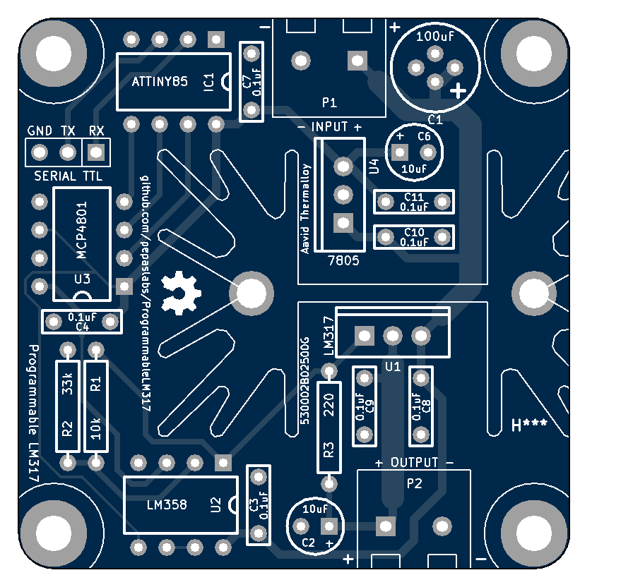
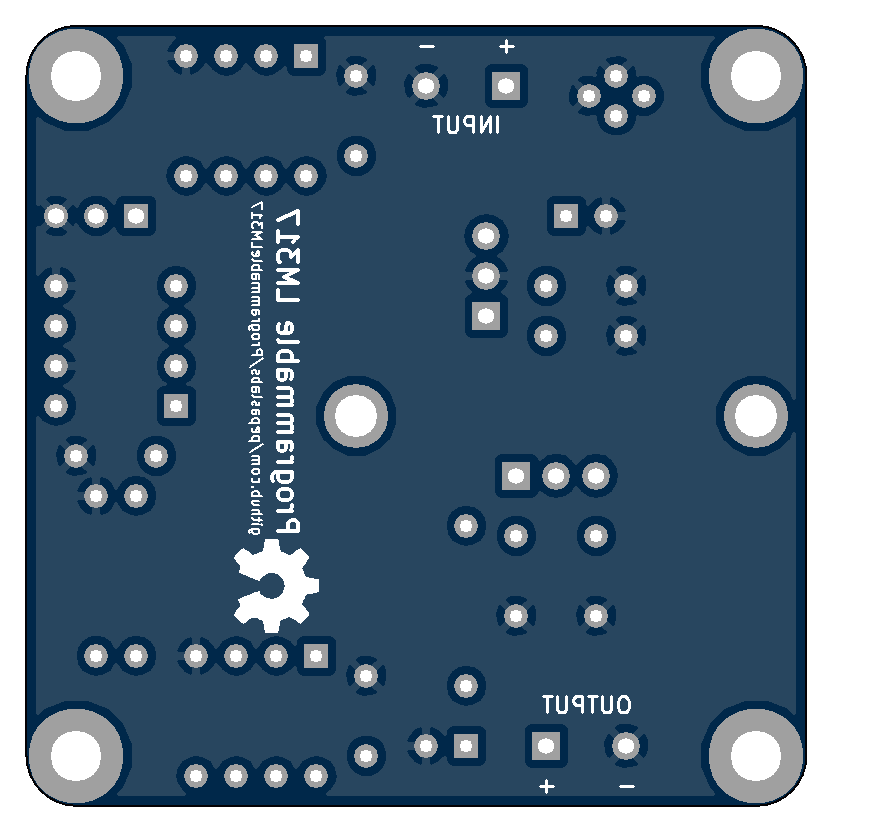

# ProgrammableLM317
A TTL-serial programmable LM317 voltage voltage supply circuit board design.

## License

This board design is [Open-Source Hardware](http://www.oshwa.org/definition/).  It is licensed under the [MIT License](http://opensource.org/licenses/MIT).  It was designed by Jason Pepas.

# Board design v2

Added protection diodes around the LM317.

## Gerbers

[gerbers.zip](releases/v2/gerbers.zip)

## Schematic

[PDF](releases/v2/ProgrammableLM317_schematic.pdf).

# Board design v1

Initial board design.

## Gerbers

[gerbers.zip](releases/v1/gerbers.zip)

## Schematic

[PDF](releases/v1/ProgrammableLM317_schematic.pdf).
