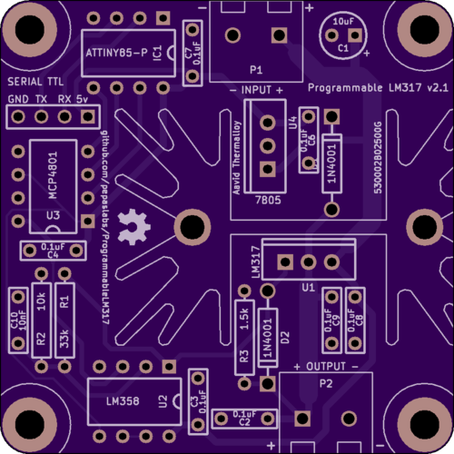
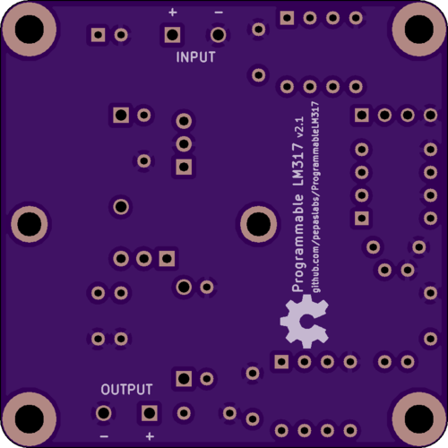

# ProgrammableLM317

A TTL-serial programmable LM317 voltage voltage supply circuit board design.

Schematic: [pdf](kicad/releases/v2.1/ProgrammableLM317.pdf).

Gerbers: [zip](kicad/releases/v2.1/gerbers.zip)

OSHPark: [link](https://oshpark.com/shared_projects/kM7WPtAO)

## License

This board design is [Open-Source Hardware](http://www.oshwa.org/definition/).  It is licensed under the [MIT License](http://opensource.org/licenses/MIT).  It was designed by Jason Pepas.

